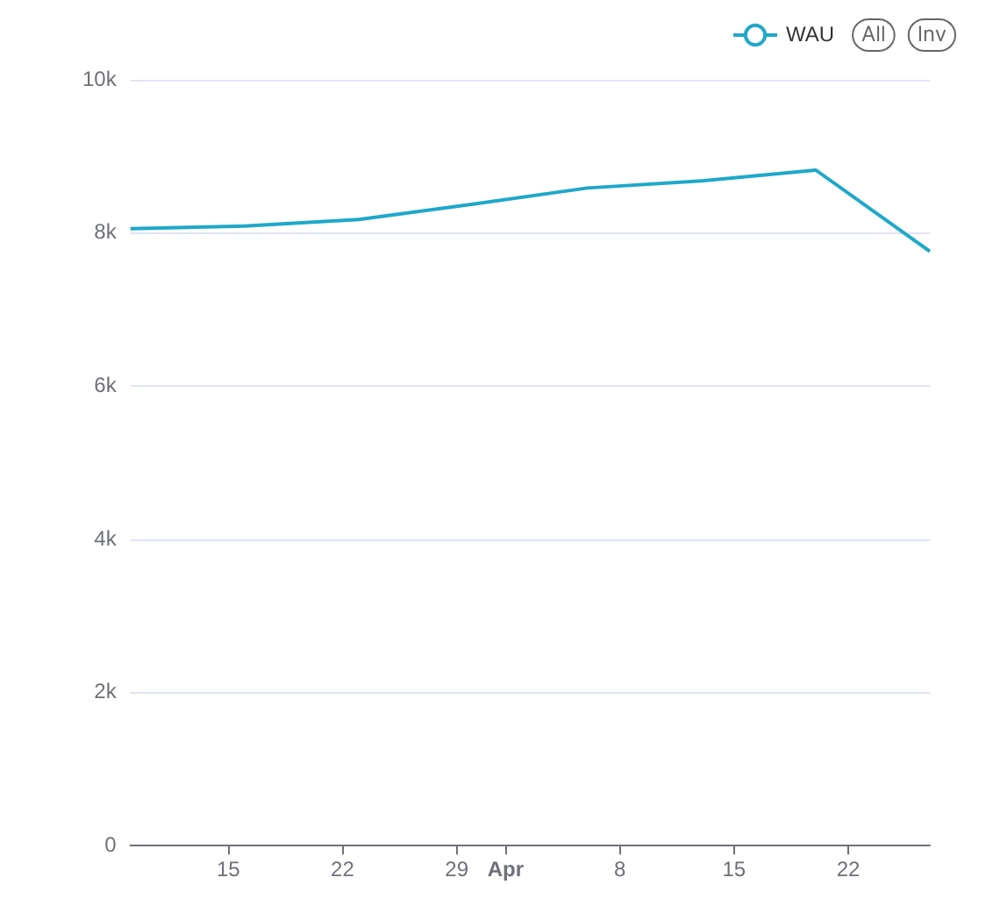
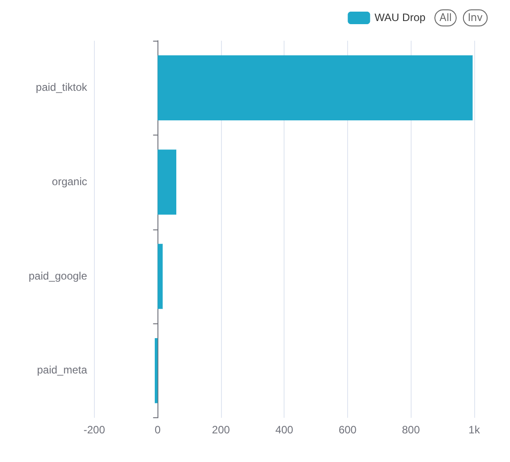
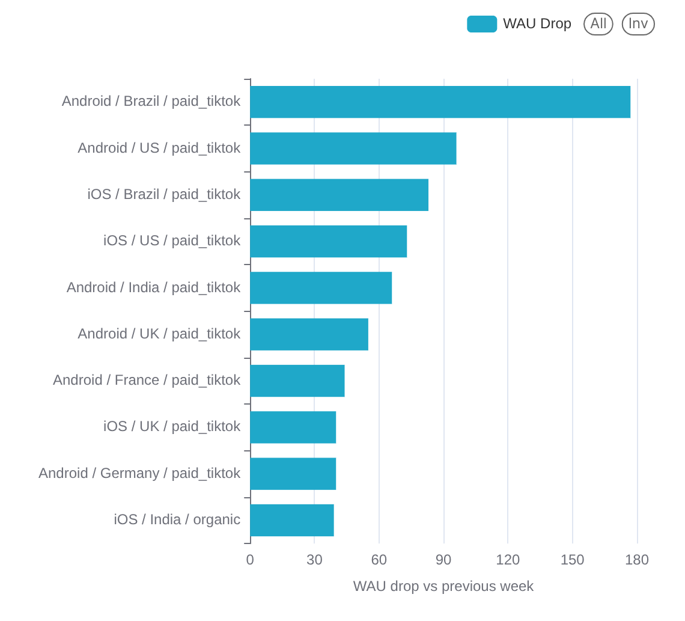

# HW5 Task 2 - WAU Drop Summary

## Situation

**WAU drop is confirmed, and the main issue is `paid_tiktok`, not overall product engagement.**

Last week, WAU dropped from **8,821** to **7,760** users. That is a decrease of **1,061 users**, or **-12.03% week-over-week**. The drop happened after several weeks of steady growth, so it looks like a sudden issue in the last week rather than a long-term downward trend.

The app itself does not show signs of weaker engagement among users who stayed active. Sessions per user stayed flat at **3.47**, and events per user slightly increased from **82.38** to **83.15**. This suggests that active users behaved normally, but fewer users were active overall.

## Complication

The drop is highly concentrated in one acquisition source: **`paid_tiktok`**.

| Source | Previous WAU | Last WAU | Change |
|---|---:|---:|---:|
| `paid_tiktok` | 2,029 | 1,034 | **-995** |
| `organic` | 3,505 | 3,446 | -59 |
| `paid_google` | 1,507 | 1,491 | -16 |
| `paid_meta` | 1,780 | 1,789 | +9 |

`paid_tiktok` alone explains **92.99%** of the total WAU drop. Other sources were mostly stable, and `paid_meta` even increased slightly.

Looking deeper, the largest drops are also concentrated in `paid_tiktok` segments, especially **Android / Brazil / paid_tiktok**, followed by **Android / US / paid_tiktok** and **iOS / Brazil / paid_tiktok**.

The issue is not only fewer new users. Existing `paid_tiktok` users dropped from **1,922** to **987**, which is a loss of **935 users**. New `paid_tiktok` users also dropped from **107** to **47**, and `paid_tiktok` installs dropped from **110** to **47**.

So the most likely story is: fewer users came from `paid_tiktok`, and many existing `paid_tiktok` users did not return in the last week.

## Resolution

This should be treated as a **paid TikTok channel issue**, not as a general product-health issue.

Recommended next steps:

1. Check whether any `paid_tiktok` campaign budget, targeting, creative, or tracking link changed around **2026-04-27**.
2. Compare TikTok Ads Manager delivery with internal attribution data for the same week.
3. Validate whether returning `paid_tiktok` users are still attributed correctly.
4. Pay special attention to Android users in Brazil and the US, since those are the largest visible drop segments.

**Recommendation:** investigate `paid_tiktok` campaign delivery and attribution first. I would not prioritize a broad app engagement investigation yet, because engagement per active user stayed stable.